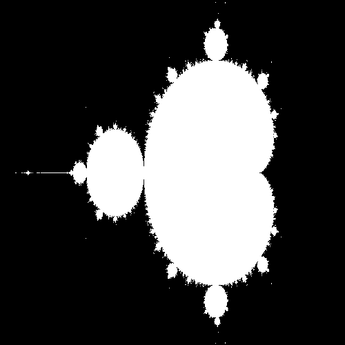

## Welcome!

River programming language is a homebrew programming language designed as an exercise to understand and build a working programming language and compiler. 


As a basic upfront disclaimer this language is *not* designed to be used in any serious or production sense.
It does not explicitly solve any issues that existing languages didn't solve decades ago. 

Still, it has been a fun project to flex my programming muscles and dive into the world of languages and compilers. 

I have published a [web based IDE for you to experiment with the language on your own.](river.danielcorcoran.xyz) 

All of the source code for the IDE is included in this repository as well. 

## Example programs

### Calculate pi via Leibniz  summation
```

= sum 0;
= max_iter 10000000;

for = n 0 ,  < n max_iter , = n + n 1
	= sum + sum * 4 / ^ -1 n . + * n 2 . 1
	print sum

kill
Output: 3.14159
```

### Mandelbrot Set

```
= resolution_x 100
= resolution_y 100

= re_start -2
= re_end 1
= im_start -1
= im_end 1

= max_iteration 100

= re_step / - re_end re_start . resolution_x
= im_step / - im_end im_start . resolution_y


imagebuffer resolution_x resolution_y

for = x_pixel 0 , < x_pixel resolution_x  , = x_pixel + x_pixel 1

	= x_coord + re_start * re_step x_pixel

	for = y_pixel 0 , < y_pixel resolution_y  , = y_pixel + y_pixel 1
		setpixel x_pixel y_pixel 0
		= y_coord + im_start * im_step y_pixel
		= plot 0
		= x 0
		= y 0

		for = iteration 0 , < iteration max_iteration , = iteration + iteration 1
			= xtemp + - * x x . * y y . . x_coord
			= y + * * 2 x . y . y_coord
			= x xtemp
		if > * 2 2 . + * x x . * y y
			setpixel x_pixel y_pixel 1


render
kill
```

Output: 


## Programming Guide

1. Declaring variables

    `= [variable name] [value]`
    
    Example:
    ```
   = pi 3.14159
   print pi
   
   output: 3.14159
   ```
   

    
2. Ternary operators
    
   `[operator] [variable 1] [variable 2] [flag name]`
   
   
If statements

Legal operators: != == <= < >= >`

    
Example:
```
   = counter 0
   = max_count 10
   flag my_flag (( We can jump to this point from anywhere in the code. ))
   + 1 counter counter
   print counter
   > counter max_count my_flag
   kill
   ```
>    Output: 1 2 3 4 5 6 7 8 9 10

   
  
3. Mathematical operations
    
Operations take the form

 `[operator] [variable 1] [variable 2] [destination variable]`
    
Legal operators: `^ - + * / `
    
 Example:
 ```
   = a 5;
   = b 7;
   = c 0;
   = d + a b (( this is analogous to a + b = d ))
   = e + a - b c . .  (( this is analogous to a + ( b - c ) = e))
   
   print d
   print e
   
   Output: 12 12
 ```

4. for loops

For loops work similarly to C++, in the sense that they have an initializer, a check, and an incremental (which is actually more of a callback)

Consult the following example: 

```
= iter 3
for = a 0 , < a iter , = a + a 1
	print a
	for = b 0 , < b iter , = b + b 1
		print b
kill
Output: 0 0 1 2 3 1 0 1 2 3 2 1 2 3
 ```                

An important thing to keep in mind when doing for loops is that the compiler only recognizes tabs, NOT SPACES as valid indentations. 


5. If statements

```
if [conditional]
   ... this code runs if conditional is met
... continue from here
```

Example
```
if > 5 4
	print 1
	if > 4 5
		print 2
	if < 2 + 2 3
		print 3
	print 4
kill
```

Output: 

```
1
3
4
```
If statements do not include `else` or `elif` operators. If you need to do an else you could run the inverse of the if statement immediately afterwards. 

6. Bitmap graphics

To do bitmap graphics you must create an imagebuffer first. 

`imagebuffer [x_dim] [y_dim]`

then you can set a pixel as either on or off:

```angular2html
setpixel [x_pixel] [y_pixel] [1 or 0]
```

Finally to output to a file run `render`. It will be outputted as a random bitmap file and the interpreter will specify 
the filepath. 

Example: 

```
= resolution_x 100
= resolution_y 100

= re_start -2
= re_end 1
= im_start -1
= im_end 1

= max_iteration 100

= re_step / - re_end re_start . resolution_x
= im_step / - im_end im_start . resolution_y


imagebuffer resolution_x resolution_y

for = x_pixel 0 , < x_pixel resolution_x  , = x_pixel + x_pixel 1

	= x_coord + re_start * re_step x_pixel

	for = y_pixel 0 , < y_pixel resolution_y  , = y_pixel + y_pixel 1
		setpixel x_pixel y_pixel 0
		= y_coord + im_start * im_step y_pixel
		= plot 0
		= x 0
		= y 0

		for = iteration 0 , < iteration max_iteration , = iteration + iteration 1
			= xtemp + - * x x . * y y . . x_coord
			= y + * * 2 x . y . y_coord
			= x xtemp
		if > * 2 2 . + * x x . * y y
			setpixel x_pixel y_pixel 1


render
kill
```

Output: 


2. Flags and GOTO

   TODO: There are a lot of bugs with this. I need to add some validation checks related to this. 
    
    `flag [flag name]`
    
    Flags serve as reference points that your code can jump to at any point.
    
    Example: 
    ```
    = a 5 . 
    = my_flag flag;
    = a + 5 a . .
    print a
    goto my_flag
  
    output: 10 20 40 80 160 ... ...
    ```                                                                               
   
