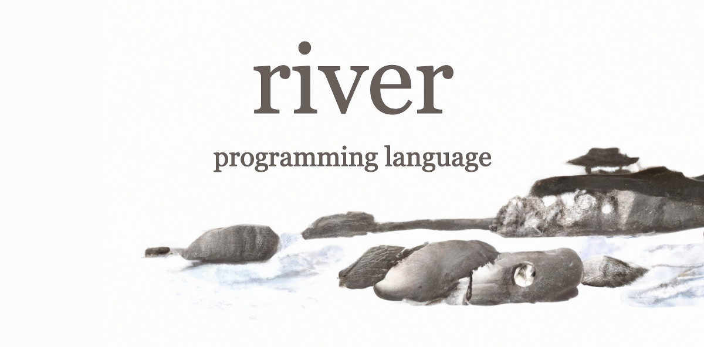

Example program: Calculate pi via Leibniz  summation
```

= sum 0;
= max_iter 10000000;

for = n 0 .  < n max_iter . = n + n 1
	= sum + sum * 4 / ^ -1 n . + * n 2 . 1
	peek sum

kill
Output: 3.14159
```

## Usage
```shell

# Compile a program to bytecode
python3 compile.py projects/for_loops/pi_chained.rr projects/for_loops/pi_chained.a

# Execute bytecode using the AFEX interpreter https://github.com/daniel-corcoran/afex
./bin/main projects/for_loops/pi_chained.a
```


## Programming specification
#### Note: I still need to update this, some of these don't work anymore with updates to the mathematical notation

1. Declaring variables

    `= [variable name] [value]`
    
    Example:
    ```
   byteword 64;
   = pi 3.14159
   peek pi
   
   output: 3.14159
   ```
2. Declaring flags
    
    `flag [flag name]`
    
    Flags serve as reference points that your code can jump to at any point.
    
    Example: 
    ```
    byteword 64;
    = 5 5;
    = my_flag flag;
    + 5 5 5
    peek 5 
    $ my_flag
    kill;
   
    output: 10 20 40 80 160 ... ...
    ```
    
3. Ternary operators
    
    `flag [operator] [variable 1] [variable 2] [flag name]`
    
    Legal operators: `!= == <= < >= >`
    If (variable 1) operator (variable_2) is true, continue to next line.
    
    If false, go to the flag statement.
    
    Example:
    ```
   byteword 64 (( Allocate 64 spaces ))
   = counter 0
   = max_count 10
   = 1 1 (( Since all values must be variables, we define integers individually. ))
   flag my_flag (( We can jump to this point from anywhere in the code. ))
   + 1 counter counter
   peek counter
   > counter max_count my_flag
   kill
   
   Output: 1 2 3 4 5 6 7 8 9 10
   
    ```
4. Mathematical operations
    
   the way math works in this language is pretty peculiar, I will do a writeup on it soon

    `[operator] [variable 1] [variable 2] [destination variable]`
    
    Legal operators: `^ - + * / `
    
    Example:
    ```
   = a 5;
   = b 7;
   = c 0;
   = + a b c ; (( a + b = c ))
   = + a - b c . . d; (( a + ( b - c ) = d))
    ```
5. FOR loops
   ### Note, a major update has changed the way this works as well, see the pi example for syntax, a writeup is needed  
   ```
        for [counter] [endpoint] [increment]
           ...   
    ```                
   
6. Nested operations
    ```
    + ^ a b c. + 5 5. out
   peek out
   = a 2; = b 3; = c 4; = out 0;
   
   Output: (2 ^ 3 ^ 4) + (5 + 5)
    ```          
7. Multidimensional arrays
``` 
    @ my_array 10 10
    for a 0 10
        for b 0 10
            my_array a b a
    peek my_array
    
    Output:
    0 1 2 3 4 5 6 7 8 9
    0 1 2 3 4 5 6 7 8 9
    0 1 2 3 4 5 6 7 8 9
    0 1 2 3 4 5 6 7 8 9
    0 1 2 3 4 5 6 7 8 9
    0 1 2 3 4 5 6 7 8 9
    0 1 2 3 4 5 6 7 8 9
    0 1 2 3 4 5 6 7 8 9
    0 1 2 3 4 5 6 7 8 9
    0 1 2 3 4 5 6 7 8 9
```                                                                                      